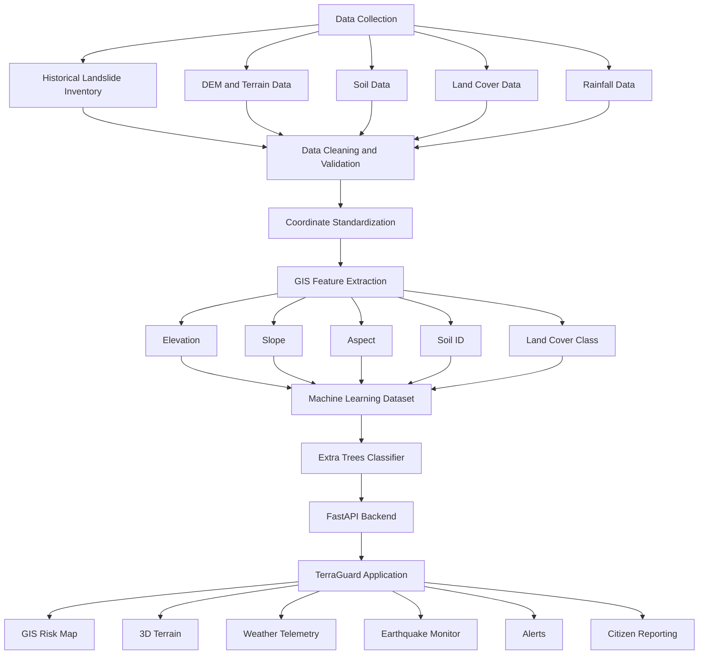

# TerraGuard
## AI-Powered Landslide Early Warning and Spatial Risk Monitoring System
> **Current repository status:** This README reflects the current TerraGuard web platform, FastAPI backend, Flutter mobile application, offline-first field reporting, TerraBot assistant, GIS/risk intelligence, alert workflows, and the V2 field-photo AI backend contract. The V2 field-photo model itself is still pending legitimate dataset acquisition and training.

**Smart India Hackathon (SIH) 2026**  
**Problem Statement: 26001**
TerraGuard is an integrated landslide risk monitoring, susceptibility assessment, spatial intelligence, and early-warning prototype designed for the North Eastern Region of India. The system combines historical landslide inventories, geospatial and environmental datasets, machine learning, GIS-based visualization, terrain analysis, live meteorological and seismic integrations, citizen reporting, and alert workflows within a unified application.
The current prototype extends the original TerraGuard platform with synchronized geographic state across map, weather, seismic, hill-region, search, and 3D terrain workflows.
---
## Table of Contents
1. [Project Overview](#project-overview)
2. [Problem Context](#problem-context)
3. [Proposed Solution](#proposed-solution)
4. [Key Objectives](#key-objectives)
5. [System Features](#system-features)
6. [Application Modules](#application-modules)
7. [New Prototype Additions](#new-prototype-additions)
8. [System Architecture](#system-architecture)
9. [Data Pipeline](#data-pipeline)
10. [Machine Learning Pipeline](#machine-learning-pipeline)
11. [Datasets](#datasets)
12. [Feature Engineering](#feature-engineering)
13. [Machine Learning Model](#machine-learning-model)
14. [Seismic and Earthquake Intelligence](#seismic-and-earthquake-intelligence)
15. [Geographic State and Synchronization](#geographic-state-and-synchronization)
16. [Weather and Environmental Telemetry](#weather-and-environmental-telemetry)
17. [Backend and API Architecture](#backend-and-api-architecture)
18. [Prediction Workflow](#prediction-workflow)
19. [Risk Classification](#risk-classification)
20. [Technology Stack](#technology-stack)
21. [Project Structure](#project-structure)
22. [Installation and Setup](#installation-and-setup)
23. [Prototype Notes and Data Integrity](#prototype-notes-and-data-integrity)
24. [Project Status](#project-status)
25. [Future Scope](#future-scope)
26. [Team](#team)
---
## Project Overview
Landslides pose significant risks to communities, transportation infrastructure, public assets, and remote settlements, particularly in mountainous and high-rainfall regions. Effective landslide risk assessment requires the integration of terrain characteristics, environmental conditions, historical events, seismic activity, and spatial information.
TerraGuard provides a unified platform for:
- Landslide susceptibility assessment using machine learning
- GIS-based visualization of risk and environmental layers
- Terrain and land-surface analysis
- Historical landslide visualization
- Location-based risk assessment
- Rainfall and environmental trigger monitoring
- Live and recent earthquake monitoring
- Earthquake-derived ground-motion indicators
- Hills and mountain region discovery
- 3D terrain exploration
- Citizen and field incident reporting
- Alert and emergency response workflows
- API-based communication between machine learning and application layers
Flutter mobile application for field users
Offline-first field reporting with local SQLite persistence and deferred synchronization
GPS-based field location capture and camera/gallery image capture
TerraBot multilingual operational assistant with navigation actions
Risk simulation and ML pipeline inspection tools
Emergency SOS, shelters, tactical units, alerts, CAP and dispatch workflows
The project combines a completed application with a geospatial machine learning pipeline built from processed regional datasets.
---
## Problem Context
Landslide occurrence is influenced by multiple environmental and geographical factors. These factors may include:
- Terrain characteristics
- Slope
- Elevation
- Aspect
- Soil conditions
- Land-cover characteristics
- Rainfall and triggering conditions
- Historical landslide occurrence
- Seismic activity and ground motion
Relevant data are commonly distributed across different sources, formats, coordinate systems, and spatial resolutions. A practical landslide monitoring system therefore requires data preparation, validation, spatial feature extraction, machine learning, and an accessible application layer.
TerraGuard addresses this requirement by organizing these components into an integrated data-to-decision workflow.
---
## Proposed Solution
TerraGuard follows the architecture below:
```text
Data Collection
      |
      v
Data Processing and Validation
      |
      v
GIS Feature Extraction
      |
      v
Machine Learning Dataset Preparation
      |
      v
Extra Trees Susceptibility Model
      |
      +----------------------+
      |                      |
      v                      v
FastAPI Backend        Live Weather / Seismic Data
      |                      |
      +----------+-----------+
                 |
                 v
        TerraGuard Application
                 |
       +---------+---------+
       |         |         |
       v         v         v
     GIS       3D       Alerts
     Risk     Terrain    & SOS
```
The platform is designed to connect environmental data processing, machine learning outputs, spatial context, and operational monitoring into one interface.
---
## Key Objectives
The primary objectives of TerraGuard are:
1. Consolidate historical landslide and environmental datasets for the study region.
2. Extract relevant terrain, soil, and land-cover features from geospatial data.
3. Build a structured machine learning dataset for landslide susceptibility classification.
4. Train and integrate an Extra Trees-based machine learning model.
5. Provide API-based prediction services through a FastAPI backend.
6. Visualize risk information through GIS-based application interfaces.
7. Synchronize selected geographic regions across all relevant application modules.
8. Integrate weather and seismic context for selected hill and mountain regions.
9. Support citizen reporting and alert workflows.
10. Establish a foundation for future real-time environmental monitoring and early warning capabilities.
---
# System Features
## Machine Learning-Based Risk Prediction
TerraGuard includes a machine learning pipeline that processes environmental and geographical features to estimate landslide susceptibility.
The established terrain classification model is:
```text
ExtraTreesClassifier
```
The model operates on structured geospatial and environmental features extracted from the project's processed datasets.
---
## GIS-Based Risk Visualization
The application supports GIS-based exploration of spatial information, including:
- Regional risk visualization
- Risk-zone filtering
- Historical landslide locations
- Machine learning susceptibility visualization
- Environmental layer controls
- Seismic event visualization
- Location inspection
- Search-driven map navigation
---
## Terrain Analysis
Digital Elevation Model data is processed to derive:
```text
Elevation
Slope
Aspect
```
These terrain variables form part of the machine learning feature set and are also used for spatial interpretation.
---
## Soil Analysis
The project integrates HWSD2 soil raster data.
Current machine learning feature:
```text
soil_id
```
The architecture can be expanded to incorporate additional soil properties, subject to metadata availability and validation.
---
## Land-Cover Analysis
Land-cover information is integrated using ESA WorldCover data.
Current machine learning feature:
```text
landcover_class
```
Land-cover information provides a representation of surface characteristics relevant to spatial susceptibility analysis.
---
## Rainfall and Trigger Monitoring
Rainfall is included as an environmental factor within the TerraGuard data architecture and supports:
- Rainfall accumulation analysis
- Trigger monitoring
- Dynamic risk assessment
- Early-warning workflows
- Live environmental data integration
The current prototype also supports coordinate-aware weather requests for selected hill and mountain regions.
---
## Citizen and Field Reporting
The application supports citizen and field reporting workflows that can capture:
- Geographic location
- Images
- Incident descriptions
- Time information
- Hazard details
This provides a mechanism for incorporating field-level observations into the broader monitoring workflow.
---
## Alert Workflows
The system architecture supports risk communication and alert workflows, including:
- Risk notifications
- Warning feeds
- Location-based alerts
- Emergency workflows
- SOS workflows
- CAP-compatible alert architecture
---
# TerraBot AI Assistant
TerraGuard includes TerraBot, an in-application assistant connected to the platform's operational context.
The current implementation combines:
```text
TerraBot Chat UI
      |
      v
Backend chatbot service
      |
      +--> Risk / location context
      +--> Weather and telemetry navigation
      +--> Earthquake monitor navigation
      +--> Hills & mountain regions
      +--> Alerts
      +--> Hazard reporting
      +--> Emergency / safety guidance
      +--> Home and module navigation
```
Multilingual Support
The chatbot backend currently defines support for:
```text
English
Hindi
Assamese
Bengali
Bodo
Khasi
Manipuri (Meitei)
Mizo
Nepali
```
The assistant can also provide navigation actions from recognized requests instead of only returning text.
Examples include:
```text
"Show current risk"
"Open earthquake monitor"
"Show hills"
"Open alerts"
"Report a hazard"
"Open emergency"
"Go home"
```
The web interface includes a TerraBot chat widget with voice-related interaction support and operational action buttons.
TerraBot is a decision-support interface. It does not replace official emergency authorities or independently authorize evacuation.
---
# Application Modules
## Home
The home interface provides:
- Project introduction
- Location discovery
- Core feature navigation
- Warning information
- Public awareness content
## Risk Dashboard
The dashboard provides:
- Location-based monitoring
- Risk indicators
- Environmental conditions
- Warning summaries
- Risk telemetry and summaries
## GIS Risk Map
The GIS module provides:
- Regional risk visualization
- Risk-zone filtering
- Environmental layer controls
- Historical landslide visualization
- Current ML susceptibility visualization
- Live earthquake visualization
- Historical earthquake empty-state handling
- Location inspection
- Search-driven navigation
## Risk Details
The risk details module provides:
- Risk scores
- Contributing environmental factors
- Environmental information
- Location-based risk interpretation
- Safety and response information
## Alerts Feed
The alerts module provides:
- Hazard warning information
- Severity filtering
- Regional filtering
- Environmental trigger information
- GIS inspection links
## Emergency SOS
The emergency module supports workflows such as:
- SOS requests
- Location sharing
- Emergency contact information
- Offline-aware communication workflows
- Safety information
## Hills & Mountain Regions
This module provides:
- Searchable hills and mountain regions
- Region selection
- Representative verified coordinates
- Region-aware weather
- Nearby/latest earthquake context
- Epicentral distance display
- Estimated PGA and MMI indicators
- External reference links such as Wikipedia/Britannica
## Earthquake Monitor
The earthquake monitor provides:
- Selected Hill Region monitoring
- Hazard Corridor Zone monitoring
- NCS earthquake event integration
- Location search
- Radius filters
- Minimum magnitude filters
- Event sorting
- Expandable earthquake event details
- Hypocentral distance
- Estimated PGA
- Instrumental MMI
- Arias intensity
- Trigger scoring
- Geotechnical advisories
## 3D Terrain
The 3D terrain interface provides geographic visualization tied to the selected hill or mountain region, allowing terrain context to follow the same geographic selection used by the GIS map.
## Additional Modules
The application also includes modules for:
- Landslide risk simulation
- Machine learning pipeline visualization
- Prediction workflows
- Citizen reporting
- Alert and dispatch workflows
---
# Flutter Mobile Application
TerraGuard includes a dedicated Flutter companion application under:
```text
mobile_app/
```
The mobile application is designed for field users and connects to the same FastAPI backend used by the web application.
Mobile Capabilities
The current mobile architecture includes:
Operational risk dashboard
Location-risk evaluation
Risk score and risk-level presentation
Risk map
Field hazard reporting
Camera/gallery image capture
GPS/location capture
Local report persistence
Offline synchronization
My Reports / report history
Emergency / SOS quick actions
Backend API synchronization
Connectivity-aware behavior
Field-photo AI classification state handling
Mobile Backend
The mobile app uses the same FastAPI application as the web platform, but runs against a separate local Uvicorn process during development:
```text
Web
React/Vite :3000
    |
    v
FastAPI :8000

Mobile
Flutter
    |
    v
FastAPI :8001
```
These are separate processes of the same backend implementation.
Android Development
Android emulators access the host machine's local backend through:
```text
http://10.0.2.2:8001
```
iOS simulator or desktop/web development can use:
```text
http://localhost:8001
```
Mobile Packages
The current Flutter project uses packages supporting:
```text
Flutter
flutter_map
geolocator
image_picker
permission_handler
connectivity_plus
sqflite
http
latlong2
uuid
url_launcher
```
The exact dependency versions are maintained in `mobile_app/pubspec.yaml`.
---
# Offline-First Field Reporting
The mobile field-report workflow is designed so that a user does not lose a report because connectivity is unavailable.
```text
User captures photo
        |
        v
GPS + metadata captured
        |
        v
Report saved locally
        |
        +--------------------+
        |                    |
        v                    v
Report Sync State       AI State
PENDING                 CLASSIFICATION_PENDING
        |
        v
Connectivity available
        |
        v
Upload report
        |
        v
Report = SYNCED
        |
        v
POST /api/reports/classify
        |
        v
V2 field-photo AI
        |
        +--> CLASSIFIED
        +--> CLASSIFICATION_FAILED
        +--> CLASSIFICATION_UNAVAILABLE
```
Local Storage
SQLite stores report metadata and provenance while captured images remain in the local filesystem.
The mobile database tracks:
```text
Report ID
Hazard type
Location
Latitude / longitude
Description
Image path
Created timestamp
Sync state
Classification state
Predicted class
Classification confidence
Classification severity
Model version
Classification timestamp
```
Separate Sync and AI States
Report synchronization:
```text
PENDING
SYNCING
SYNCED
SYNC_FAILED
```
AI classification:
```text
NOT_CLASSIFIED
CLASSIFICATION_PENDING
CLASSIFIED
CLASSIFICATION_FAILED
CLASSIFICATION_UNAVAILABLE
```
This separation is important: a report can successfully reach the backend even when the AI model is unavailable.
Mobile Safety Behavior
The app does not present an unavailable model as a successful AI result.
It uses language such as:
```text
AI visual classification: landslide
```
rather than:
```text
AI confirms a landslide
```
The field-photo classifier does not independently modify the location-risk score, trigger evacuation, or send SMS.
---
# Field-Photo AI Classifier V2
TerraGuard has a dedicated field-photo AI pipeline separate from the established location-risk model.
Target Classes
```text
landslide
rockfall
roadBlockage
slopeFailure
flood
other
```
Production Pipeline
```text
Legitimate external datasets
        |
        v
Source and license verification
        |
        v
Cleaning + deduplication
        |
        v
Train / validation / test split
        |
        v
Lightweight image classifier
        |
        v
Real evaluation
        |
        v
ONNX export
        |
        v
ONNX Runtime
        |
        v
FastAPI
        |
        v
POST /api/reports/classify
        |
        v
Flutter
```
Current V2 Backend State
The repository currently contains the strict V2 contract and artifact gate.
```text
V2 API contract                   COMPLETE
No-V1-fallback behavior           COMPLETE
Artifact validation gate          COMPLETE
Backend regression tests          PASSING
External dataset acquisition      PENDING
License verification              PENDING
Real model training               PENDING
Held-out evaluation               PENDING
Production ONNX artifact         PENDING
Real inference benchmark          PENDING
Mobile/backend E2E classification PENDING
```
The project does not fabricate dataset counts, training metrics, model size, or latency.
Artifacts
When training is complete, the production artifacts are intended to be:
```text
backend/ml/artifacts/field_report_classifier_v2.onnx
backend/ml/artifacts/field_report_classifier_v2.json
```
Confidence Policy
```text
>= 0.80  HIGH
>= 0.65  MEDIUM
>= 0.55  LOW
<  0.55  other / UNKNOWN
```
Confidence represents visual classification confidence, not physical hazard severity.
No V1 Fallback
If the V2 ONNX artifact is missing or cannot load, the backend reports classification unavailable/error.
It does not silently run the historical deterministic V1 classifier.
API
```text
POST /api/reports/classify
```
Mobile-compatible fields include:
```text
report_id
image
hazard_type
latitude
longitude
state
zone_id
description
timestamp
```
Expected response:
```json
{
  "report_id": "...",
  "predicted_class": "landslide",
  "confidence": 0.87,
  "severity": "HIGH",
  "model_version": "v2",
  "processed_at": "2026-09-20T..."
}
```
---
# New Prototype Additions
The current prototype retains the original TerraGuard capabilities and adds the following major workflows.
## 1. Authoritative Geographic State
`MapContext` is used as the shared geographic state for the application.
The selected region and map focus coordinates are designed to remain consistent across:
```text
Hills & Mountain Regions
        |
        +--> GIS Risk Map
        |
        +--> 3D Terrain
        |
        +--> Weather
        |
        +--> Earthquake / Seismic Context
        |
        +--> Search
        |
        +--> Browser Navigation
```
This reduces conflicting local copies of selected-region state.
---
## 2. Coordinate-Aware Weather
The weather API accepts:
```text
state
latitude
longitude
region_name
```
For a verified hill or mountain region, the application's selected coordinates are forwarded to the weather service so the environmental context follows the selected region rather than relying only on a state-level default.
---
## 3. Seismic Ground-Motion Metrics
The prototype includes seismic utility calculations for:
- Epicentral distance
- Hypocentral distance
- Estimated PGA
- PGA as `% g`
- Instrumental MMI
- Arias intensity
- Composite destabilization / trigger scoring
- Time-decay effects
The implementation is intended for prototype hazard visualization and decision-support workflows.
---
## 4. Historical Map Mode Separation
Historical mode distinguishes historical event visualization from the current ML inference layer.
The application supports an explicit current-risk overlay rather than silently presenting present-day ML output as historical data.
---
## 5. Unified Spatial Search
Search is designed to span multiple spatial categories:
```text
Risk Zones
Hills & Mountain Regions
Historical Landslides
NCS Earthquakes
```
Selecting search results can update the geographic context and map focus.
---
## 6. Browser Navigation Restoration
The prototype integrates browser history with geographic/module state so that:
```text
Select Region A
      |
      v
Select Region B
      |
      v
Browser Back
      |
      v
Restore Region A
      |
      v
Browser Forward
      |
      v
Restore Region B
```
This is intended to make navigation behave more predictably during map-driven exploration.
---
## 7. Safe Historical Earthquake Handling
When an authoritative historical earthquake archive is unavailable, TerraGuard presents an empty state instead of inventing historical earthquake events.
This keeps the historical earthquake interface distinguishable from live NCS data.
---
## 8. External Reference Link Isolation
Wikipedia, Britannica, and similar reference links are treated as external navigation.
Opening a source link should not mutate the application's selected geographic state.
---
# Web and GIS Intelligence
The React/Vite web application acts as the main operational command interface.
Web Technology
```text
React
TypeScript
Vite
Tailwind CSS
Leaflet
Lucide React
Motion
```
Operational Modules
The current web application contains modules/components for:
```text
Home
Risk Dashboard
Risk Details
Spatial GIS Command
Alerts
Emergency SOS
Hills & Mountain Regions
Earthquake Monitor
3D Terrain
Temporal LSTM Predictor
Landslide Risk Simulator
Crowdsource / CV Verification
Broadcast & Dispatch
ML Pipeline Command
TerraBot
About
```
The application uses lazy-loaded operational modules and a shared `MapContext` for geographic state.
Geographic Synchronization
The selected region and map coordinates can be propagated across:
```text
Hills & Mountain Regions
        |
        +--> GIS Risk Map
        +--> 3D Terrain
        +--> Weather
        +--> Earthquake Monitor
        +--> Search
        +--> Browser navigation
```
GIS Functions
The platform supports:
Risk-zone visualization
Historical landslide visualization
ML susceptibility visualization
Environmental layers
Location inspection
Spatial search
Earthquake overlays
Hill/mountain region selection
3D terrain context
Current-risk versus historical-map separation
---
# Alert, Emergency and Dispatch Workflows
TerraGuard includes a backend alert engine and operator-facing emergency workflows.
Alert Engine
The backend exposes alert functionality for:
```text
CAP alerts
Tactical units
Relief shelters
Audit logs
Acoustic siren simulation
Dispatch orders
Emergency SMS broadcast
```
The alert engine evaluates report and environmental trigger information and can create CAP-compatible alert payloads.
Emergency SOS
The web application provides an Emergency SOS module with:
SOS access
Emergency contact information
Location context
Safety information
Offline-aware location behavior
The mobile application also exposes an Emergency / SOS quick action.
Shelters and Tactical Response
The backend maintains structures for:
```text
Relief shelters
Tactical units
Audit logs
Alert dispatch records
```
These support the demonstration of an operational disaster-response workflow.
SMS
The current project keeps SMS dispatch in demo mode until the required provider/DLT activation is available.
The field-photo classifier itself does not send SMS.
---
# System Architecture

---
# Data Pipeline
The data engineering workflow is organized as follows:
```text
Data Acquisition
      |
      v
Data Cleaning
      |
      v
Data Validation
      |
      v
Duplicate Handling
      |
      v
Coordinate Standardization
      |
      v
Regional Filtering
      |
      v
Environmental Raster Processing
      |
      v
Spatial Feature Extraction
      |
      v
Positive and Background Sample Preparation
      |
      v
Final Machine Learning Dataset
```
---
# Machine Learning Pipeline
```text
Historical Landslide Data
            +
Environmental GIS Data
            |
            v
Data Cleaning
            |
            v
Coordinate Standardization
            |
            v
Regional Data Filtering
            |
            v
Raster Feature Extraction
            |
            v
Elevation
Slope
Aspect
Soil ID
Land Cover Class
            |
            v
Positive Landslide Samples
            +
Background / Negative Samples
            |
            v
Final Machine Learning Dataset
            |
            v
Dataset Validation
            |
            v
Model Training
            |
            v
Extra Trees Classifier
            |
            v
Model Prediction
            |
            v
FastAPI Inference
            |
            v
TerraGuard Application
```
---
# Datasets
## Terrain and DEM Data
Location:
```text
data/dem/
```
Processed terrain datasets include:
```text
NER_elevation.tif
NER_slope.tif
NER_aspect.tif
```
| Feature | Description |
|---|---|
| Elevation | Height above sea level |
| Slope | Terrain steepness |
| Aspect | Terrain direction |
---
## Soil Data
Location:
```text
data/soil/
```
Main raster:
```text
NER_HWSD2_soil.tif
```
Current machine learning feature:
```text
soil_id
```
---
## Land-Cover Data
Location:
```text
data/landcover/
```
Processed raster:
```text
NER_landcover.tif
```
Source:
```text
ESA WorldCover
```
Current machine learning feature:
```text
landcover_class
```
Additional analysis output:
```text
NER_landcover_class_frequency.csv
```
---
## India Landslide Master Dataset
Final dataset:
```text
India_Landslide_Master_Final.csv
```
The original TerraGuard data-processing workflow consolidated multiple landslide sources into a common India inventory.
---
## North Eastern Region Landslide Dataset
Dataset:
```text
NER_Landslide_Records_Final.csv
```
The regional inventory is used as the basis for the North Eastern Region modelling workflow.
---
# Feature Engineering
Environmental raster features were extracted for the regional landslide inventory.
Dataset:
```text
NER_Landslide_Training_Features.csv
```
Core extracted features:
```text
elevation
slope
aspect
soil_id
landcover_class
```
---
# Positive Training Dataset
Dataset:
```text
NER_Landslide_Training_Features_Clean.csv
```
Class label:
```text
label = 1
```
These records represent historical landslide locations with complete environmental feature values.
---
# Background / Negative Samples
Dataset:
```text
NER_Background_Samples_Validated.csv
```
Class label:
```text
label = 0
```
These samples represent background locations used for the landslide classification dataset.
---
# Final Machine Learning Dataset
Dataset:
```text
NER_Landslide_ML_Dataset.csv
```
Core dataset columns include:
```text
latitude_standardized
longitude_standardized
elevation
slope
aspect
soil_id
landcover_class
label
sample_type
```
The final dataset is processed to remove invalid and duplicate records and to address conflicting labels.
---
# Location-Risk ML Model
## Terrain + Rainfall Ensemble
The original TerraGuard prediction architecture combines complementary models:
```text
Terrain model: ExtraTreesClassifier
Rainfall model: RandomForestClassifier
```
The terrain model is the established landslide susceptibility model used throughout the current application workflow.
The rainfall model is used as a complementary environmental signal where the required rainfall-window features are available.
The combined architecture is intended to provide:
- Non-linear relationship modelling
- Interaction capture
- Structured tabular-data classification
- Probability-based outputs
- Feature importance analysis
- Ensemble-based risk interpretation
---
# Seismic and Earthquake Intelligence
TerraGuard integrates live/recent earthquake information through the National Center for Seismology (NCS) workflow used by the application.
## Earthquake Metrics
For a selected region and earthquake event, the prototype calculates or presents:
- Epicentral distance
- Hypocentral distance
- Estimated Peak Ground Acceleration (PGA)
- PGA in `% g`
- Instrumental Modified Mercalli Intensity (MMI)
- Arias intensity
- Focal proximity
- Composite trigger score
- Time-decay contribution
The seismic metrics are intended as prototype decision-support indicators rather than a substitute for authoritative engineering or emergency-management products.
---
# Geographic State and Synchronization
A selected hill or mountain region is treated as the main geographic context.
When a verified region is selected, the application can propagate:
```text
Region
Coordinates
Map focus
Weather query
Earthquake query
3D terrain focus
Search context
Browser history state
```
Representative coordinates are used where the data source provides a verified representative point rather than an exact polygon boundary. The application should not interpret a representative point as an exact administrative or geographic boundary.
---
# Weather and Environmental Telemetry
The backend weather route supports:
```text
/api/weather/live
```
Optional request parameters include:
```text
state
latitude
longitude
region_name
```
The prototype uses coordinate-aware weather retrieval for selected geographic regions.
The current implementation can use public meteorological data through Open-Meteo and retains an offline fallback for prototype continuity.
A response can distinguish live data from fallback data using:
```text
is_live_feed
```
where live service responses are marked as live and offline fallback responses are marked as not live.
Some prototype dashboard metrics may use baseline/fallback values when external services are unavailable. These values are intended for prototype continuity and should not be interpreted as authoritative measurements.
---
# Backend and API Architecture
TerraGuard uses a Python-based backend architecture centered on:
```text
FastAPI
Python
Uvicorn
Pydantic
```
The backend supports:
- Prediction requests
- Machine learning model inference
- Input validation
- Weather telemetry
- Earthquake/seismic APIs
- Reporting workflows
- Alert workflows
- Frontend-backend communication
When the backend is running locally, FastAPI interactive API documentation is available at:
```text
http://127.0.0.1:8000/docs
```
---
# Prediction Workflow
```text
TerraGuard Application
           |
           v
API Request
           |
           v
FastAPI Backend
           |
           v
Input Validation
           |
           v
Feature Preparation
           |
           v
Extra Trees Classifier
           |
           v
Prediction Output
           |
           v
Risk Classification
           |
           v
API Response
           |
           v
Risk Visualization
           |
           v
Alert Workflow
```
---
# Risk Classification
Prediction outputs can be presented through the following risk categories:
| Risk Level | Interpretation |
|---|---|
| Low | Lower estimated susceptibility |
| Moderate | Moderate estimated environmental risk |
| High | High estimated susceptibility |
| Critical | Requires immediate attention based on configured thresholds |
These categories support:
- Dashboard visualization
- GIS visualization
- Risk monitoring
- Warning workflows
- Decision support
---
# Technology Stack
| Layer | Technology |
|---|---|
| Frontend | React |
| Language | TypeScript |
| Build Tool | Vite |
| UI | Tailwind CSS |
| Icons | Lucide React |
| Animation | Motion |
| Backend | FastAPI |
| Backend Language | Python |
| API Server | Uvicorn |
| Validation | Pydantic |
| Machine Learning | Scikit-learn |
| Primary ML Model | Extra Trees Classifier |
| Data Processing | Pandas, NumPy |
| Visualization | Matplotlib / Interactive Web Maps |
| Geospatial Data | GeoTIFF / Raster Data |
| GIS | Interactive Map Layers |
| Terrain | DEM, Elevation, Slope, Aspect |
| Soil | HWSD2 |
| Land Cover | ESA WorldCover |
| Weather | Open-Meteo / Prototype telemetry adapters |
| Earthquake Source | National Center for Seismology (NCS) |
---
# Project Structure
```text
landslide-ai/
│
├── backend/
│   ├── routers/
│   │   ├── earthquakes.py
│   │   ├── weather.py
│   │   └── ...
│   ├── services/
│   │   ├── weather_service.py
│   │   └── ...
│   └── main.py
│
├── public/
│
├── src/
│   ├── components/
│   │   ├── GisMapContainer.tsx
│   │   ├── HillsMountainRegions.tsx
│   │   ├── SpatialGisCommand.tsx
│   │   ├── ThreeDMapView.tsx
│   │   └── ...
│   │
│   ├── context/
│   │   └── MapContext.tsx
│   │
│   ├── data/
│   │   └── hillsData.ts
│   │
│   ├── services/
│   │   └── api.ts
│   │
│   ├── utils/
│   │   └── seismicMetrics.ts
│   │
│   ├── types.ts
│   ├── App.tsx
│   └── main.tsx
│
├── data/
│   ├── dem/
│   ├── soil/
│   └── landcover/
│
├── models/
├── notebooks/
├── scripts/
├── README.md
├── package.json
└── requirements.txt
```
---
# Installation and Setup
## Prerequisites
Install:
```text
Node.js
npm
Python 3.x
Git
```
---
## Clone the Repository
```bash
git clone https://github.com/supernovadevssihproject-team/landslide-ai.git
cd landslide-ai
```
---
## Frontend Setup
Install dependencies:
```bash
npm install
```
Start the development server:
```bash
npm run dev
```
The Vite development server will display the local URL in the terminal.
---
## Backend Setup
Create and activate a Python virtual environment:
### Windows
```powershell
python -m venv .venv
.venv\Scripts\Activate.ps1
```
### Linux / macOS
```bash
python3 -m venv .venv
source .venv/bin/activate
```
Install Python dependencies:
```bash
pip install -r requirements.txt
```
TerraGuard uses one FastAPI application implementation. For local development, run separate Uvicorn instances for the web and mobile workflows:
Web backend:
```bash
python -m uvicorn backend.main:app --reload --host 127.0.0.1 --port 8000
```
Web API documentation:
```text
http://127.0.0.1:8000/docs
```
Mobile backend instance:
```bash
python -m uvicorn backend.main:app --reload --host 127.0.0.1 --port 8001
```
Mobile API documentation:
```text
http://127.0.0.1:8001/docs
```
These are two processes of the same FastAPI application, with separate ports for the current local web and mobile workflows. The web browser uses Vite at `http://127.0.0.1:3000`, whose API proxy targets port `8000`. The Flutter app targets port `8001` (`10.0.2.2:8001` from an Android emulator).
The local endpoint split is:
```text
WEB:    http://127.0.0.1:3000 -> http://127.0.0.1:8000
MOBILE: Flutter app          -> http://127.0.0.1:8001
```
---
## Build Verification
Frontend lint:
```bash
npm run lint
```
Production build:
```bash
npm run build
```
Backend syntax verification:
```bash
python -m compileall backend
```
---
# Validation and Testing
Web
```bash
npm run lint
npm run build
```
The current web workflow has been validated with TypeScript checks and a production Vite build.
Backend
```bash
python -m compileall backend
python backend/test_api.py
```
The current V2 contract/no-fallback backend changes have been validated by the backend API test suite.
Mobile
From `mobile_app/`:
```bash
flutter analyze
flutter test
```
The offline field-report implementation has been validated with Flutter analysis and tests.
Important Integration Test
Once the real V2 ONNX artifact is available, the final E2E test must verify:
```text
Flutter photo capture
      |
      v
Local SQLite report
      |
      v
Backend upload
      |
      v
POST /api/reports/classify
      |
      v
ONNX Runtime
      |
      v
Real prediction
      |
      v
Confidence + severity
      |
      v
Mobile CLASSIFIED state
```
No model performance value should be documented until measured on the actual deployed artifact.
---
# Prototype Notes and Data Integrity
TerraGuard is currently a **prototype / portfolio / demonstration application**.
Important implementation notes:
- Live external services may be unavailable or rate-limited.
- Offline fallback data can be used to preserve application continuity.
- Prototype baseline values may appear for selected environmental metrics when an external service is unavailable.
- Fallback data should not be interpreted as real-time authoritative measurements.
- Historical earthquake records are not fabricated when a verified archive is unavailable.
- Representative hill coordinates are used where a source provides a representative point rather than an exact boundary polygon.
- Seismic metrics are intended for prototype decision support and visualization.
For operational disaster-management deployment, all external data sources, geospatial boundaries, alert thresholds, model calibration, and engineering formulas should undergo domain validation and independent verification.
---
# Project Status
Prototype / Demonstration Ready — Full Web + Mobile Platform
Web Platform
```text
Core web application                  COMPLETE
GIS risk visualization                COMPLETE
Shared geographic state               COMPLETE
Weather integration                   COMPLETE
Earthquake monitoring                 COMPLETE
3D terrain context                    COMPLETE
Risk dashboard                        COMPLETE
Risk details                          COMPLETE
Alerts feed                           COMPLETE
Emergency SOS                         COMPLETE
Hills / mountain regions              COMPLETE
TerraBot assistant                    COMPLETE
Risk simulation                       COMPLETE
ML pipeline interface                 COMPLETE
Crowdsource reporting                 COMPLETE
Broadcast / dispatch interface        COMPLETE
```
Flutter Mobile
```text
Mobile application                    COMPLETE
Location-risk API integration         COMPLETE
GPS field capture                     COMPLETE
Camera/gallery capture                COMPLETE
Local SQLite persistence              COMPLETE
Connectivity-aware synchronization    COMPLETE
Offline report queue                  COMPLETE
My Reports workflow                   COMPLETE
Separate report/AI states             COMPLETE
Mobile risk map                       COMPLETE
Emergency / SOS quick action          COMPLETE
V2 classifier API integration seam    COMPLETE
```
Field-Photo AI V2
```text
Backend API contract                  COMPLETE
Strict no-V1 fallback                 COMPLETE
Artifact validation gate              COMPLETE
Backend regression tests              PASSING
External dataset acquisition          PENDING
License verification                  PENDING
Real model training                   PENDING
Held-out evaluation                   PENDING
Production ONNX artifact              PENDING
Real inference benchmark              PENDING
Mobile/backend E2E AI test            PENDING
```
The project intentionally distinguishes implemented software contracts from uncompleted model training. No field-photo AI accuracy or deployment performance is claimed until the real model is trained and tested.
# Future Scope
Future TerraGuard development can include:
- Real-time IMD data integration
- Verified satellite and radar feeds
- Higher-resolution precipitation products
- Soil-moisture data integration
- Real-time sensor networks
- More detailed seismic hazard models
- Verified historical earthquake archives
- Improved regional administrative boundaries
- Larger and more representative training datasets
- Explainable AI dashboards
- Model calibration with field observations
- Automated alert threshold optimization
- SMS / email / push notification integrations
- Offline-first field applications
- Mobile deployment
- Cloud-native deployment
- Continuous model monitoring and retraining
- Production-grade data provenance and auditability
---

# Deployment
TerraGuard can be deployed as a split frontend/backend application because the project contains a React/Vite frontend and a FastAPI backend.
## Deployment Architecture
```text
Users
  |
  v
Public Frontend
React + Vite
  |
  | HTTPS API Requests
  v
FastAPI Backend
  |
  +-------------------+
  |                   |
  v                   v
ML Models        External Services
                 Weather / NCS
```
## Frontend Deployment
The frontend can be built for production using:
```bash
npm run build
```
The resulting Vite production output is normally generated in:
```text
dist/
```
The `dist/` directory can be served by a static hosting platform or a conventional web server.
Before deployment, configure the frontend API base URL or environment variables required by the project so that production requests point to the deployed FastAPI service rather than the local backend.
Example production workflow:
```text
1. Install Node.js dependencies
2. Configure production environment variables
3. Run npm run build
4. Deploy the generated dist/ directory
5. Configure the backend API URL
6. Verify CORS and HTTPS connectivity
```
## Backend Deployment
The FastAPI backend can be started with:
```bash
python -m uvicorn backend.main:app --host 0.0.0.0 --port 8000
```
For a production deployment, the backend should run behind a production-capable process manager or application platform.
Required backend configuration should include:
```text
Python environment
Required Python packages
Model files
Application configuration
CORS settings
External API configuration
```
The API documentation is available at:
```text
https://<your-backend-domain>/docs
```
when the service is publicly deployed.
## Environment Variables
Do not commit private credentials or API keys to the repository.
Use an environment file for local development, for example:
```text
.env
```
and provide a safe example file such as:
```text
.env.example
```
Typical configuration may include:
```text
VITE_API_BASE_URL=
BACKEND_CORS_ORIGINS=
WEATHER_API_KEY=
EARTHQUAKE_API_CONFIG=
OTHER_SERVICE_KEYS=
```
Only define variables that are actually required by the deployment configuration.
## CORS
When the frontend and backend are hosted on different domains, configure FastAPI CORS to allow the production frontend origin.
Example:
```text
Frontend:
https://your-frontend-domain
Backend:
https://your-backend-domain
```
Do not use an unrestricted production CORS configuration unless it is intentionally required and understood.
## Model and Data Deployment
The deployment must make all required machine learning artifacts and runtime data available to the backend. This includes the V2 field-photo ONNX artifact once training is complete.
Depending on repository size, large files may be:
```text
Stored in the repository
Stored in object storage
Mounted from a persistent volume
Downloaded during deployment
Managed through a model/data registry
```
Verify that the deployed backend can locate:
```text
Model files
Required GIS data
Configuration files
Required lookup tables
```
## Production Verification Checklist
After deployment, verify:
```text
[ ] Frontend loads successfully
[ ] Backend health/API endpoint responds
[ ] CORS allows frontend requests
[ ] Prediction endpoint works
[ ] GIS map renders
[ ] 3D terrain renders
[ ] Hill selection updates geographic context
[ ] Weather endpoint responds
[ ] Earthquake endpoint responds
[ ] Alerts and reporting workflows operate
[ ] External source links open correctly
[ ] Browser Back/Forward restores geographic state
[ ] No secret keys are exposed in frontend source
[ ] HTTPS is enabled for public deployment
```
## Prototype Deployment Note
TerraGuard is currently a prototype and can be deployed as a demonstration application. A production disaster-management deployment should additionally include:
- Production-grade monitoring
- Authentication and authorization
- Secure secret management
- Rate limiting
- Data provenance
- Strong API validation
- Centralized logging
- Backups
- Model/version tracking
- Domain-specific validation of hazard metrics
- High-availability infrastructure
- Independent verification of authoritative data sources
## SMS Gateway Setup & India DLT Activation
TerraGuard's emergency dispatch pipeline uses **SMSHorizon** (India Bulk DLT gateway) for localized emergency SMS alerts.
> [!NOTE]
> Real SMS dispatch requires active SMSHorizon account credentials and TRAI DLT activation (Entity ID, Sender ID, and Approved Template ID). SMSHorizon activation requests are currently pending. Until activation is complete, TerraGuard runs with `SMS_DEMO_MODE=true` to demonstrate full end-to-end emergency workflows truthfully without sending fake SMS or displaying unverified delivery receipts.
### Production Activation Steps
Once SMSHorizon account approval and TRAI DLT template registration are granted:
1. **Log in to SMSHorizon Console** and copy your API Key.
2. **Register TRAI DLT Entity & Header (Sender ID)** (e.g. Entity ID `100123...`, Sender ID `GSISIK`).
3. **Register DLT Approved SMS Template**:
   - Approved Text: `[GSI-LEWS ALERT] {#var#}. {#var#} Call 1077.`
   - Note down the approved `DLT_TEMPLATE_ID`.
4. **Update Environment Variables** in `backend/.env` or environment:
   ```env
   SMS_PROVIDER=sms_horizon
   SMS_DEMO_MODE=false
   SMSHORIZON_API_KEY="your_api_key_here"
   SMSHORIZON_SENDER_ID="GSISIK"
   SMSHORIZON_DLT_ENTITY_ID="100123..."
   SMSHORIZON_TEMPLATE_ID="200456..."
   SMSHORIZON_API_URL="https://smshorizon.in/api/sendsms.php"
   ```
5. **Restart Backend Server**:
   ```bash
      python -m uvicorn backend.main:app --host 0.0.0.0 --port 8000
   ```
6. **Execute Verification**:
   Send a test dispatch via mobile app emergency sheet or web operator console. The backend will transmit the request to SMSHorizon and return `status: "sent"` upon provider confirmation.
---
# Team
**Supernova Devs — SIH Project Team**
## Team Members
- B NITHIN CHANDRA — https://github.com/bnithinchandra-dotcom
- B DHANUSH — https://github.com/bondidhanush01-bit
- B Kedar Sharma — https://github.com/frostblack548-stack
- Ch Naga Manaswini — https://github.com/chnagamanaswini
- D Prajnasree — https://prajnasree.github.io
- Hasini chappidi — https://github.com/hasini-ch-7

TerraGuard was developed as a collaborative Smart India Hackathon project and is being further developed as a professional portfolio and applied geospatial AI prototype.
---
## Repository
GitHub:
```text
https://github.com/supernovadevssihproject-team/landslide-ai
```
---
# License
This project is free to use by anyone.
For licensing or usage-related questions, please contact the TerraGuard team.
