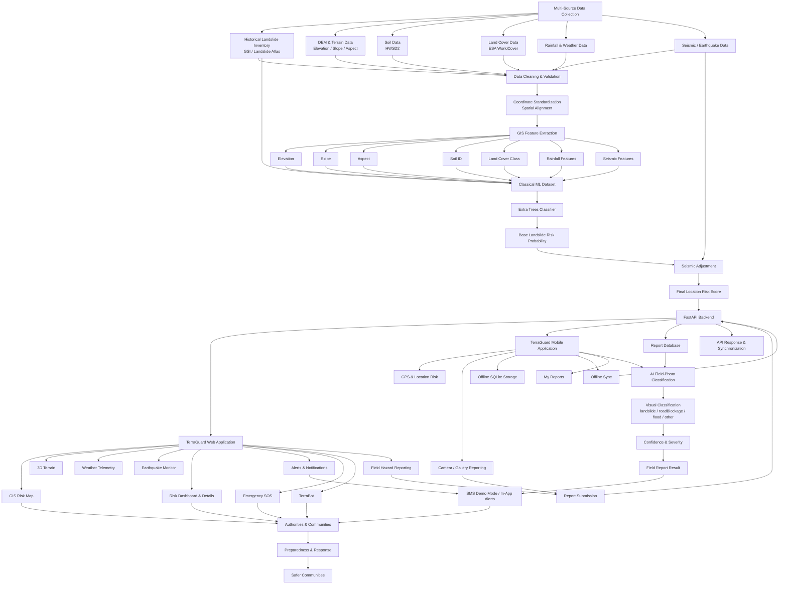

# TerraGuard

## AI-Powered Landslide Risk, Spatial Intelligence, Field Reporting & Early-Warning Platform

**Smart India Hackathon 2026 · Problem Statement 26001**

TerraGuard is an integrated disaster-intelligence prototype for landslide-risk monitoring and field intelligence in the North Eastern Region of India. It combines geospatial risk assessment, terrain and environmental analysis, weather and seismic context, field reporting, AI-assisted field-image classification, offline-first mobile reporting, alerts, emergency workflows, and TerraBot decision support.

---
## 🔗 Project Links

- 🌐 **Live Demo:** https://terraguard-ner.duckdns.org/
- 📦 **Submission Files & APK:** https://drive.google.com/drive/folders/1DpWlCq8kI3R_jSXFXnF2aenznaKuZNT2?usp=sharing
- 💻 **GitHub Repository:** https://github.com/supernovadevssihproject-team/landslide-ai

## Table of Contents

### Project Overview
1. [Platform Overview](#1-platform-overview)
   - [What TerraGuard Does](#what-terraguard-does)
   - [Core Objectives](#core-objectives)
   - [Platform Components](#platform-components)
   - [Two Intelligence Pipelines](#two-intelligence-pipelines)
2. [Problem & Objectives](#2-problem--objectives)
   - [Problem Context](#problem-context)
   - [Project Objectives](#project-objectives)
   - [Target Users](#target-users)

### Architecture & Application
3. [Architecture](#3-architecture)
   - [High-Level Architecture](#high-level-architecture)
   - [Web Architecture](#web-architecture)
   - [Backend Architecture](#backend-architecture)
   - [Mobile Architecture](#mobile-architecture)
   - [Data Flow](#data-flow)
   - [Service Boundaries](#service-boundaries)
4. [Web Platform](#4-web-platform)
   - [Home](#home)
   - [Risk Dashboard](#risk-dashboard)
   - [Risk Details](#risk-details)
   - [Spatial GIS Command](#spatial-gis-command)
   - [Alerts](#alerts)
   - [Emergency SOS](#emergency-sos)
   - [Hills & Mountain Regions](#hills--mountain-regions)
   - [Earthquake Monitor](#earthquake-monitor)
   - [3D Terrain](#3d-terrain)
   - [Temporal LSTM Predictor](#temporal-lstm-predictor)
   - [Landslide Risk Simulator](#landslide-risk-simulator)
   - [Crowdsource / CV Verification](#crowdsource--cv-verification)
   - [Broadcast & Dispatch](#broadcast--dispatch)
   - [ML Pipeline Command](#ml-pipeline-command)
   - [TerraBot](#terrabot)
   - [About](#about)
5. [Web User Manual](#5-web-user-manual)
   - [Starting the Web Application](#starting-the-web-application)
   - [Navigation](#navigation)
   - [Viewing Risk](#viewing-risk)
   - [Using GIS](#using-gis)
   - [Using 3D Terrain](#using-3d-terrain-1)
   - [Monitoring Weather](#monitoring-weather)
   - [Monitoring Earthquakes](#monitoring-earthquakes)
   - [Submitting a Field Report](#submitting-a-field-report)
   - [Using Alerts](#using-alerts)
   - [Using Emergency SOS](#using-emergency-sos-1)
   - [Using TerraBot](#using-terrabot)
   - [Troubleshooting Web Workflows](#troubleshooting-web-workflows)

### Reporting, Mobile & Offline
6. [Field Reporting & AI](#6-field-reporting--ai)
   - [Field Report Lifecycle](#field-report-lifecycle)
   - [Image Upload](#image-upload)
   - [Location Metadata](#location-metadata)
   - [Report Persistence](#report-persistence)
   - [Field-Photo AI V2](#field-photo-ai-v2)
   - [Classification Output](#classification-output)
   - [Classification Limitations](#classification-limitations)
7. [Mobile Application](#7-mobile-application)
   - [Flutter Application](#flutter-application)
   - [Mobile Features](#mobile-features)
   - [GPS and Location Risk](#gps-and-location-risk)
   - [Camera and Gallery](#camera-and-gallery)
   - [My Reports](#my-reports)
   - [Emergency / SOS](#emergency--sos)
   - [Connectivity-Aware Operation](#connectivity-aware-operation)
8. [Mobile User Manual](#8-mobile-user-manual)
   - [Installation](#installation)
   - [First Launch](#first-launch)
   - [Checking Location Risk](#checking-location-risk)
   - [Creating a Report](#creating-a-report)
   - [Saving a Report Offline](#saving-a-report-offline)
   - [Synchronizing Reports](#synchronizing-reports)
   - [Viewing Classification](#viewing-classification)
   - [Viewing My Reports](#viewing-my-reports)
   - [Using Emergency SOS](#using-emergency-sos-2)
9. [Offline-First Design](#9-offline-first-design)
   - [Offline Architecture](#offline-architecture)
   - [SQLite Storage](#sqlite-storage)
   - [Report States](#report-states)
   - [AI Classification States](#ai-classification-states)
   - [Synchronization Flow](#synchronization-flow)
   - [Failure Handling](#failure-handling)
   - [Offline Data Integrity](#offline-data-integrity)

### Machine Learning & Geospatial Intelligence
10. [Risk & ML System](#10-risk--ml-system)
    - [Classical ML Location-Risk Model](#classical-ml-location-risk-model)
    - [Training Inputs](#training-inputs)
    - [Feature Set](#feature-set)
    - [Extra Trees Classifier](#extra-trees-classifier)
    - [Inference Pipeline](#inference-pipeline)
    - [Seismic Adjustment](#seismic-adjustment)
    - [Final Risk Score](#final-risk-score)
    - [Field-Photo Classifier Separation](#field-photo-classifier-separation)
11. [GIS, Terrain, Weather & Seismic](#11-gis-terrain-weather--seismic)
    - [GIS Risk Map](#gis-risk-map)
    - [DEM / Elevation](#dem--elevation)
    - [Slope](#slope)
    - [Aspect](#aspect)
    - [Soil](#soil)
    - [Land Cover](#land-cover)
    - [Rainfall](#rainfall)
    - [Weather Telemetry](#weather-telemetry)
    - [Earthquake Monitoring](#earthquake-monitoring)
    - [3D Terrain](#3d-terrain-1)
12. [TerraBot](#12-terrabot)
    - [Purpose](#purpose)
    - [Supported Languages](#supported-languages)
    - [Supported Questions](#supported-questions)
    - [Navigation Actions](#navigation-actions)
    - [Grounding and Safety](#grounding-and-safety)
13. [Alerts & Emergency](#13-alerts--emergency)
    - [Alerts](#alerts-1)
    - [Emergency SOS](#emergency-sos-2)
    - [Broadcast & Dispatch](#broadcast--dispatch-1)
    - [SMS Demo Mode](#sms-demo-mode)
    - [Safety Boundaries](#safety-boundaries)

### Backend, Data & APIs
14. [Backend & API](#14-backend--api)
    - [FastAPI Backend](#fastapi-backend)
    - [Backend Routers](#backend-routers)
    - [Location-Risk Endpoints](#location-risk-endpoints)
    - [Field Reporting Endpoints](#field-reporting-endpoints)
    - [AI Classification Endpoint](#ai-classification-endpoint)
    - [ML Model Information](#ml-model-information)
    - [Weather Endpoints](#weather-endpoints)
    - [Alerts and Notification Endpoints](#alerts-and-notification-endpoints)
    - [Chat / TerraBot Endpoints](#chat--terrabot-endpoints)
    - [Health Checks](#health-checks)
    - [Request / Response Contracts](#request--response-contracts)
15. [Data Pipeline](#15-data-pipeline)
    - [Data Sources](#data-sources)
    - [Landslide Inventory](#landslide-inventory)
    - [Rainfall Dataset](#rainfall-dataset)
    - [DEM and Terrain Rasters](#dem-and-terrain-rasters)
    - [Soil Dataset](#soil-dataset)
    - [Land Cover Dataset](#land-cover-dataset)
    - [Seismic Data](#seismic-data)
    - [Feature Preparation](#feature-preparation)
    - [Spatial Alignment](#spatial-alignment)
    - [Data Validation](#data-validation)
16. [Repository Structure](#16-repository-structure)
    - [Root Structure](#root-structure)
    - [Web Source](#web-source)
    - [Backend Source](#backend-source)
    - [Mobile Source](#mobile-source)
    - [ML Artifacts](#ml-artifacts)
    - [Documentation](#documentation)

### Setup, Configuration & Quality
17. [Installation](#17-installation)
    - [Prerequisites](#prerequisites)
    - [Clone the Repository](#clone-the-repository)
    - [Install Web Dependencies](#install-web-dependencies)
    - [Install Backend Dependencies](#install-backend-dependencies)
    - [Install Flutter Dependencies](#install-flutter-dependencies)
    - [Run the Development Stack](#run-the-development-stack)
18. [Development Commands](#18-development-commands)
    - [Web Commands](#web-commands)
    - [Backend Commands](#backend-commands)
    - [Mobile Commands](#mobile-commands)
    - [ML Commands](#ml-commands)
    - [Validation Commands](#validation-commands)
19. [Configuration](#19-configuration)
    - [Environment Variables](#environment-variables)
    - [API Base URLs](#api-base-urls)
    - [Android Emulator Networking](#android-emulator-networking)
    - [CORS](#cors)
    - [Model Artifact Configuration](#model-artifact-configuration)
20. [Testing & Validation](#20-testing--validation)
    - [Python Compilation](#python-compilation)
    - [Backend API Tests](#backend-api-tests)
    - [Web Lint](#web-lint)
    - [Web Build](#web-build)
    - [Flutter Analyze](#flutter-analyze)
    - [Flutter Tests](#flutter-tests)
    - [Git Diff Validation](#git-diff-validation)
    - [End-to-End Smoke Testing](#end-to-end-smoke-testing)
21. [Troubleshooting](#21-troubleshooting)
    - [Web Cannot Reach Backend](#web-cannot-reach-backend)
    - [Backend Port Conflict](#backend-port-conflict)
    - [Mobile Cannot Reach Backend](#mobile-cannot-reach-backend)
    - [Android Emulator Networking](#android-emulator-networking-1)
    - [Offline Sync Problems](#offline-sync-problems)
    - [Image Classification Problems](#image-classification-problems)
    - [Missing ML Artifact](#missing-ml-artifact)
    - [Database Problems](#database-problems)
    - [SMS Provider Limitations](#sms-provider-limitations)

### Transparency, Workflow & Project Information
22. [Security & Safety](#22-security--safety)
    - [Input Validation](#input-validation)
    - [Image Handling](#image-handling)
    - [API Safety](#api-safety)
    - [AI Safety Boundaries](#ai-safety-boundaries)
    - [Emergency Workflow Boundaries](#emergency-workflow-boundaries)
23. [Dataset & Model Transparency](#23-dataset--model-transparency)
    - [Classical Location-Risk ML Model](#classical-location-risk-ml-model)
    - [Classical ML Dataset Categories](#classical-ml-dataset-categories)
    - [Field-Photo AI Classifier V2](#field-photo-ai-classifier-v2)
    - [Field-Photo Dataset](#field-photo-dataset)
    - [Dataset Provenance](#dataset-provenance)
    - [Model Interpretation](#model-interpretation)
    - [Classical ML vs Field-Photo AI](#classical-ml-vs-field-photo-ai)
24. [End-to-End Workflow](#24-end-to-end-workflow)
    - [System Workflow](#system-workflow)
    - [Field Reporting Workflow](#field-reporting-workflow)
    - [Mobile Synchronization States](#mobile-synchronization-states)
    - [Classical ML Location-Risk Workflow](#classical-ml-location-risk-workflow)
    - [Classical ML Inference Path](#classical-ml-inference-path)
    - [Field-Photo AI Workflow](#field-photo-ai-workflow)
    - [Geographic Context Workflow](#geographic-context-workflow)
25. [Team](#25-team)
    - [Team Members](#team-members)
    - [Repository](#repository)
26. [License](#26-license)


# 1. Platform Overview

TerraGuard follows an operational loop:

```text
OBSERVE
  ↓
Terrain + Rainfall + Soil + Land Cover + Seismic + Historical Data
  ↓
ASSESS
  ↓
Location Risk + GIS + Weather + Earthquake Context
  ↓
REPORT
  ↓
Field Photo + GPS + Description
  ↓
CLASSIFY
  ↓
Field-Photo AI
  ↓
RESPOND
  ↓
Alerts + Emergency + Dispatch + Decision Support
```

The project intentionally separates two intelligence paths:

### Location-risk intelligence

The existing geospatial/environmental ML pipeline evaluates structured features such as elevation, slope, aspect, soil, land cover, and rainfall.

### Field-photo intelligence

The V2 ONNX classifier processes submitted photographs independently. Its output does **not** modify the location-risk probability.

---

# 2. Problem & Objectives

Landslide risk depends on interacting terrain, rainfall, geological, land-cover, historical, and seismic conditions. These datasets often exist in different formats and spatial resolutions.

TerraGuard aims to:

- consolidate landslide and environmental information;
- derive terrain and spatial features;
- estimate location-based susceptibility/risk;
- visualize risk through GIS;
- provide weather and earthquake context;
- collect citizen/field observations;
- classify field photographs using AI;
- preserve reports during connectivity loss;
- synchronize offline reports when connectivity returns;
- support alerts, SOS, shelters, tactical units and dispatch workflows;
- provide multilingual decision support through TerraBot;
- provide a foundation for future real-time deployment.

TerraGuard is a **decision-support prototype**, not a replacement for official disaster-management authorities.

---

# 3. Architecture

```text
                         TERRAGUARD
                             │
          ┌──────────────────┼──────────────────┐
          │                  │                  │
       WEB APP          FLUTTER MOBILE      TERRABOT
          │                  │                  │
          └──────────────────┼──────────────────┘
                             │
                        FastAPI Backend
                             │
          ┌──────────────────┼──────────────────┐
          │                  │                  │
     Risk Engine       Field Reports       AI Engine
          │                  │                  │
          │                  │            ONNX Runtime
          │                  │                  │
          │                  │          Field Classifier
          └──────────────────┼──────────────────┘
                             │
                    Database / Local Storage
```

### Development topology

```text
Web:             localhost:3000
Backend (Web):   localhost:8000
Backend (Mobile):localhost:8001
Android emulator:10.0.2.2:8001
```

These are development addresses only. Production must use HTTPS and a deployed API URL.

---

# 4. Web Platform

The React/Vite Web application provides the main operational interface.

## Major modules

- Home
- Risk Dashboard
- Spatial GIS Command / Risk Map
- Risk Details
- Alerts Feed
- Emergency SOS
- Hills & Mountain Regions
- Earthquake Monitor
- 3D Terrain
- Temporal prediction / analysis
- Landslide Risk Simulator
- Citizen / Field Reporting
- Broadcast & Dispatch
- ML Pipeline Command
- TerraBot
- About

The application also contains shared API services, application context, data/configuration, internationalization, utilities, and reusable UI components.

---

# 5. Web User Manual

## 5.1 Home

Use Home to understand the project and navigate to the major operational modules.

Typical flow:

```text
Open TerraGuard  Review overview  Select Risk / Map / Report / Emergency / TerraBot
```

## 5.2 Risk Dashboard

Use the dashboard for fast situational awareness.

Review:

- selected location/region;
- risk indicators;
- environmental information;
- warning summaries;
- available risk telemetry.

## 5.3 GIS Risk Map

Use GIS when spatial context is required.

```text
Open GIS
 select/search region
 inspect map
 enable relevant layers
 select a location
 review risk/context
```

The GIS workflow supports risk visualization, historical landslides, ML susceptibility, environmental layers, earthquake events, field information, and location inspection.

## 5.4 Risk Details

Use Risk Details to inspect a selected location's score, risk level, contributing factors, and supporting environmental information.

## 5.5 Hills & Mountain Regions

Use this module to search/select supported hill and mountain regions.

The selected geographic context can feed:

- GIS;
- 3D terrain;
- weather;
- earthquake/seismic context;
- search/navigation.

## 5.6 Weather

Weather requests can use state, latitude, longitude, and region name so that environmental context follows the selected region.

The UI should distinguish live data from cached/offline fallback data.

## 5.7 Earthquake Monitor

Use Earthquake Monitor to inspect seismic events and derived context.

Typical workflow:

```text
Open Earthquake Monitor
 choose region/corridor
 apply filters
 select event
 inspect event and derived indicators
```

The module can expose magnitude, depth, location, time, distance, estimated PGA, MMI, Arias intensity, trigger scoring, and advisories where available.

## 5.8 3D Terrain

Use 3D Terrain to understand the selected geographic area visually and compare it with GIS/risk information.

## 5.9 Alerts

Use Alerts to inspect warning information and filter by available severity, region, and hazard context.

## 5.10 Emergency / SOS

Use Emergency/SOS for the application's emergency workflow. Continue to use official emergency services and established disaster-response procedures for real incidents.

## 5.11 Broadcast & Dispatch

The platform contains CAP-style alert, siren, tactical-unit, shelter, audit, and SMS broadcast workflows. SMS is currently **demo mode**.

---

# 6. Field Reporting & AI

Field reporting is the bridge between the operational platform and observations from the ground.

## 6.1 Web field-report workflow

```text
Select Photo
   ↓
Validate Image
   ↓
Enter Location + Description + Hazard
   ↓
Submit Multipart Request
   ↓
FastAPI
   ↓
POST /api/reports/classify
   ↓
ONNX Runtime
   ↓
Prediction + Confidence + Severity + Model Version
   ↓
Display Real Result
```

The current Web integration sends the actual image to the classifier rather than using a fake AI response.

## 6.2 Image requirements

The current Web field-report UI validates image type and limits the selected file to **15 MB**.

Use clear, relevant photographs whenever possible.

## 6.3 AI response

Example:

```json
{
  "report_id": "demo-1",
  "predicted_class": "landslide",
  "confidence": 0.55,
  "severity": "LOW",
  "model_version": "v2",
  "processed_at": "..."
}
```

The values depend on the submitted image.

## 6.4 Interpretation

AI confidence is **visual classification confidence**. It is not:

- official hazard confirmation;
- physical landslide severity;
- evacuation authorization;
- official disaster declaration.

Use the AI result together with location risk, terrain, rainfall, seismic context, field verification, and official procedures.

---

# 7. Mobile Application

The Flutter application is located under:

```text
mobile_app/
```

The project is named `terraguard_mobile`.

## Capabilities

- operational risk dashboard;
- risk map;
- camera capture;
- gallery selection;
- GPS/location capture;
- field hazard reporting;
- local SQLite persistence;
- offline synchronization;
- My Reports;
- emergency/SOS;
- backend API synchronization;
- field-photo AI classification;
- connectivity-aware behavior.

## Main Flutter dependencies

The current application uses packages including:

- `connectivity_plus`
- `flutter_map`
- `geolocator`
- `http`
- `image_picker`
- `latlong2`
- `path`
- `permission_handler`
- `sqflite`
- `url_launcher`
- `uuid`

Development/testing also uses Flutter test/lint tooling and SQLite FFI support.

---

# 8. Mobile User Manual

## 8.1 Start the app

```bash
cd mobile_app
flutter pub get
flutter run
```

Grant camera and location permissions when requested.

## 8.2 Check risk

Open the risk dashboard/map to review the current operational context before reporting a field hazard.

## 8.3 Create a field report

```text
Open Field Report
 Capture/select photo
 Confirm GPS
 Select hazard type
 Add description
 Save report
 Synchronize when available
 Review AI result
```

## 8.4 Online workflow

```text
Photo + GPS + metadata
        ↓
Local report
        ↓
Sync
        ↓
Backend
        ↓
AI classification
        ↓
Store/display result
```

## 8.5 Offline workflow

```text
Photo + GPS + metadata
        ↓
SQLite local storage
        ↓
PENDING
        ↓
Connection returns
        ↓
SYNCING
        ↓
Backend upload
        ↓
SYNCED
        ↓
AI classification
        ↓
CLASSIFIED / FAILED / UNAVAILABLE
```

A successful report upload is intentionally independent from the later AI result.

## 8.6 My Reports

Use My Reports to inspect locally stored/synchronized field reports and their synchronization/classification states.

## 8.7 Emergency

Use the Emergency/SOS workflow when needed. For real emergencies, use official emergency channels as well.

---

# 9. Offline-First Design

The mobile offline layer uses SQLite for report metadata and stores captured images as local files referenced by the report record.

Important offline components include:

```text
mobile_app/lib/offline/
├── database_schema.dart
├── field_classification_api.dart
├── field_report_capture_service.dart
├── offline_hazard_report.dart
├── offline_hazard_report_page.dart
├── offline_report_store.dart
├── offline_reports_page.dart
├── offline_sync_manager.dart
├── terraguard_database_models.dart
├── terraguard_http_sync_api.dart
└── terraguard_offline_services.dart
```

## Report states

```text
PENDING  SYNCING  SYNCED
              └── SYNC_FAILED
```

## AI states

```text
NOT_CLASSIFIED
      ↓
CLASSIFICATION_PENDING
      ↓
CLASSIFIED

or

CLASSIFICATION_FAILED
CLASSIFICATION_UNAVAILABLE
```

The two state machines must remain separate.

---

# 10. Risk & ML System

## 10.1 Location-risk model

The established location-risk pipeline uses structured environmental/geospatial features including:

```text
elevation
slope
aspect
soil_id
landcover_class
rainfall_1d
rainfall_3d
rainfall_7d
rainfall_15d
rainfall_30d
```

The repository documents an Extra Trees susceptibility model as the established terrain/environmental classifier. The active backend implementation is the runtime source of truth.

## 10.2 Seismic adjustment

The existing risk logic includes:

```text
Delta_seismic = S_seismic × 0.20 × (1 - P_base)
P_final = clamp(P_base + Delta_seismic, 0, 1)
Final Score = P_final × 100
```

The field-photo AI does not alter this calculation.

## 10.3 ML API

The Web/API layer exposes ML operations including:

```text
POST /api/ml/predict
GET  /api/ml/model-info
GET  /api/ml/metrics
GET  /api/ml/comparison
GET  /api/ml/feature-importance
GET  /api/ml/datasets
```

---

# 11. GIS, Terrain, Weather & Seismic

## GIS

The Web GIS uses Leaflet and supports spatial layers, risk visualization, historical events, seismic context, and field-report locations.

## Terrain

DEM data is used to derive:

```text
Elevation
Slope
Aspect
```

These features support both spatial interpretation and ML.

## Soil

HWSD2 soil information is represented in the ML feature pipeline using `soil_id`.

## Land Cover

ESA WorldCover information is represented through `landcover_class`.

## Rainfall

Rainfall supports environmental trigger and dynamic-risk workflows.

## Earthquakes

The seismic subsystem provides event monitoring and derived ground-motion/context indicators where configured.

---

# 12. TerraBot

TerraBot is the in-application multilingual operational assistant.

## Supported languages

```text
en  English
hi  Hindi
as  Assamese
bn  Bengali
brx Bodo
ks  Khasi
mni Manipuri / Meitei
lus Mizo
ne  Nepali
```

## Example commands

```text
Show current risk
Open earthquake monitor
Show hills
Open alerts
Report a hazard
Open emergency
Go home
```

TerraBot can return navigation actions as well as text.

It is a decision-support interface and does not independently authorize evacuation.

---

# 13. Alerts & Emergency

The alert architecture includes:

- risk notifications;
- warning feeds;
- location-based alerts;
- CAP-compatible alert structure;
- siren workflow;
- relief shelters;
- tactical units;
- audit logs;
- SMS status/broadcast workflow;
- emergency/SOS workflows.

### SMS status

SMS is currently **DEMO MODE**. The field-photo classifier never directly sends SMS.

---

# 14. Backend & API

The backend is FastAPI with Uvicorn.

## Health

```http
GET /health
GET /api/health
```

## Field reports

```http
POST /api/reports/submit
POST /api/reports/classify
POST /api/reports/sync-offline
POST /api/reports/{report_id}/escalate
POST /api/reports/{report_id}/dismiss
```

## Alerts

```http
GET  /api/alerts/cap
POST /api/alerts/siren
GET  /api/alerts/units
GET  /api/alerts/shelters
GET  /api/alerts/audit-logs
GET  /api/alerts/sms-status
POST /api/alerts/sms-broadcast
```

## Weather

```http
GET /api/weather/live
```

## ML

```http
POST /api/ml/predict
GET  /api/ml/model-info
GET  /api/ml/metrics
GET  /api/ml/comparison
GET  /api/ml/feature-importance
GET  /api/ml/datasets
```

## GIS/zone ML

```http
GET /api/zones/historical-training-events
GET /api/zones/historical-training-events/timeline
GET /api/zones/{zone_id}/ml-risk
GET /api/zones/ml-heatmap-points
```

## Chatbot

```http
POST /api/chat
```

The exact route implementation in `backend/routers/` and `backend/services/` is the source of truth.

---

# 15. Data Pipeline

The broader geospatial pipeline follows:

```text
Raw Data
  ↓
Validation
  ↓
Cleaning / CRS handling
  ↓
Raster + Vector Processing
  ↓
Feature Extraction
  ↓
ML Dataset
  ↓
Training / Evaluation
  ↓
FastAPI
  ↓
Web + Mobile
```

Data categories include:

- landslide inventory;
- rainfall;
- DEM/elevation;
- slope/aspect;
- soil;
- land cover;
- seismic data;
- weather;
- field reports.

---

# 16. Repository Structure

```text
landslide-ai/
├── .env.example
├── .gitignore
├── README.md
├── index.html
├── metadata.json
├── package.json
├── package-lock.json
├── tsconfig.json
├── vite.config.ts
│
├── backend/
│   ├── main.py
│   ├── requirements.txt
│   ├── test_api.py
│   ├── routers/
│   ├── services/
│   └── ml/
│       ├── field_report_classifier.py
│       ├── train_field_report_classifier.py
│       ├── prepare_field_report_dataset.py
│       ├── artifacts/
│       └── datasets/
│
├── data/
├── docs/
├── ml/
├── public/
│
├── mobile_app/
│   ├── android/
│   ├── ios/
│   ├── windows/
│   ├── assets/
│   ├── lib/
│   ├── test/
│   ├── pubspec.yaml
│   └── README.md
│
└── src/
    ├── App.tsx
    ├── main.tsx
    ├── index.css
    ├── types.ts
    ├── components/
    ├── context/
    ├── data/
    ├── i18n/
    ├── services/
    └── utils/
```

### Important source areas

**Web:** `src/App.tsx`, `src/components/`, `src/context/`, `src/data/`, `src/i18n/`, `src/services/`, `src/utils/`, `src/types.ts`

**Backend:** `backend/main.py`, `backend/routers/`, `backend/services/`, `backend/ml/`, `backend/test_api.py`

**Mobile:** `mobile_app/lib/main.dart`, `config/`, `offline/`, `risk_map_page.dart`, `operational_risk_api.dart`, `theme/`, `widgets/`

---

# 17. Installation

## Web + Backend

```bash
npm install
```

Install Python dependencies from:

```text
backend/requirements.txt
```

Start Web backend:

```bash
python -m uvicorn backend.main:app --reload --host 127.0.0.1 --port 8000
```

Start Web:

```bash
npm run dev
```

## Mobile

```bash
cd mobile_app
flutter pub get
flutter run
```

Start the mobile backend separately on port `8001`:

```bash
cd ..
python -m uvicorn backend.main:app --reload --host 127.0.0.1 --port 8001
```

---

# 18. Development Commands

## Web

```bash
npm run dev
npm run build
npm run lint
npm run preview
```

## Backend

```bash
python -m compileall backend
python backend/test_api.py
```

## Mobile

```bash
cd mobile_app
flutter analyze
flutter test
```

## Git safety

```bash
git status
git diff --stat
git diff --check
git fetch origin
git push origin HEAD
```

Never use force-push for normal team synchronization.

---

# 19. Configuration

The root repository contains:

```text
.env.example
```

Never commit API keys, provider credentials, tokens, or private secrets.

## Mobile API configuration

`mobile_app/lib/config/app_config.dart` supports:

```text
TERRAGUARD_API_BASE_URL
TERRAGUARD_WEB_URL
```

Local defaults:

```text
Android emulator  http://10.0.2.2:8001
iOS/Desktop/Web   http://localhost:8001
Web URL           http://localhost:3000
```

For production, use an HTTPS backend URL through `TERRAGUARD_API_BASE_URL`.

---

# 20. Testing & Validation

The current integrated codebase has been validated locally.

## Backend

```text
24/24 API tests passed
```

## Web

```text
npm run lint   PASS
npm run build  PASS
```

## Mobile

```text
flutter analyze  No issues found
flutter test     6 tests passed
```

## AI runtime

The current V2 ONNX artifact loads on CPU and the classification endpoint has been exercised through the local backend.

A validated example from the integration pass returned:

```text
HTTP 200
predicted_class = landslide
confidence       = 0.55
model_version    = v2
```

## Repository

```text
git diff --check  PASS
```

The integrated changes were safely synchronized to the remote `main` branch without a force push.

---

# 21. Troubleshooting

## Web cannot reach backend

Check:

1. backend process is running;
2. correct port is used;
3. API/proxy configuration is correct;
4. CORS allows the Web origin;
5. browser Network/Console logs.

## Mobile cannot reach backend

Android emulator:

```text
http://10.0.2.2:8001
```

Other local platforms:

```text
http://localhost:8001
```

Confirm the mobile backend process is running on `8001`.

## AI classification fails

Check:

1. `field_report_classifier_v2.onnx` exists;
2. `field_report_classifier_v2.json` exists;
3. `onnxruntime` is installed;
4. image is valid;
5. image is within the upload-size limit;
6. backend logs;
7. `/api/ml/model-info`;
8. `/api/reports/classify` response.

The V2 runtime must fail clearly if the artifact is unavailable. It must not silently run an old V1 implementation.

## Flutter issues

```bash
cd mobile_app
flutter pub get
flutter analyze
flutter test
```

## Web build issues

```bash
npm install
npm run lint
npm run build
```

Fix the first real build/type error before changing unrelated code.

---

# 22. Security & Safety

Before production:

- use HTTPS;
- protect secrets;
- restrict CORS appropriately;
- validate uploaded files;
- enforce upload-size limits;
- validate image formats;
- protect administrative operations;
- use persistent/backed-up storage;
- review authentication/authorization requirements;
- monitor API failures;
- minimize unnecessary personal data.

TerraGuard's AI does not independently:

- authorize evacuation;
- modify location-risk probabilities;
- change official thresholds;
- send emergency SMS;
- declare an official disaster;
- replace trained responders.

---

# 23. Dataset & Model Transparency

TerraGuard contains two separate machine-learning pipelines. They solve different problems and use different data. The field-photo classifier must not be confused with the main geographic location-risk model.

## 23.1 Classical location-risk ML model

The classical ML pipeline estimates landslide susceptibility/risk for a geographic location from structured environmental and geospatial features.

### Model purpose

```text
Input:
geospatial + environmental conditions

        ↓

Feature extraction / preprocessing

        ↓

Classical ML susceptibility model

        ↓

Base landslide probability

        ↓

Seismic adjustment

        ↓

Final location-risk score
```

### Established model

The repository documents an Extra Trees susceptibility model as the established terrain/environmental classifier. The active backend implementation remains the runtime source of truth.

### Main features

The location-risk model uses structured features such as:

```text
elevation
slope
aspect
soil_id
landcover_class
rainfall_1d
rainfall_3d
rainfall_7d
rainfall_15d
rainfall_30d
```

### Dataset categories

The classical ML dataset pipeline was built from geospatial and environmental sources rather than photographs. The project data includes:

| Dataset / source category | Example project data | Role |
|---|---|---|
| Landslide inventory | GSI landslide inventory / Landslide Atlas-derived data | Historical landslide labels and locations |
| Rainfall | `NER_Landslide_Rainfall_ML_Dataset_654.csv` and rainfall data | Precipitation-related predictors |
| Elevation / DEM | `NER_elevation.tif` | Terrain elevation |
| Slope | `NER_slope.tif` | Terrain steepness |
| Aspect | `NER_aspect.tif` | Terrain orientation |
| Soil | `NER_HWSD2_soil.tif` | Soil/environmental characteristics |
| Land cover | ESA WorldCover GeoTIFF data | Land-cover class |
| Seismic context | Earthquake/seismic data used by the risk pipeline | Seismic adjustment/context |

The geospatial datasets are processed into structured ML features before inference. Raster layers can have different spatial resolutions and coordinate reference systems, so preprocessing and spatial alignment are part of the data pipeline.

### Important distinction

The classical ML model does **not** use the field-photo dataset as its training dataset.

The main location-risk prediction is based on geographic/environmental evidence. A submitted field photograph is handled by the separate field-photo AI pipeline described below.

## 23.2 Field-photo AI classifier V2

The field-photo model analyzes an image submitted through the Web or Mobile field-report workflow.

### Model purpose

```text
Field photograph

        ↓

Image preprocessing

        ↓

ONNX image classifier

        ↓

Visual classification

        ↓

Class + confidence + severity
```

### Runtime contract

The current V2 artifact defines four runtime classes:

```text
landslide
roadBlockage
flood
other
```

Configuration:

| Parameter | Value |
|---|---|
| Model version | `v2` |
| Model type | `YOLO-classification-ONNX` |
| Image size | `224 × 224` |
| Runtime | `onnxruntime` |
| Execution | CPU |
| Confidence threshold | `0.55` |

### Field-photo dataset used during integration

The prototype field-photo dataset was assembled separately from the geospatial ML data:

| Class | Train | Validation | Test |
|---|---:|---:|---:|
| `landslide` | 38 | 8 | 9 |
| `roadBlockage` | 1 | 0 | 1 |
| `flood` | 2 | 0 | 2 |
| `other` | 244 | 52 | 54 |

The dataset has strong landslide/other representation but very limited supporting-class coverage. In particular, `roadBlockage` and `flood` have no validation samples.

Therefore, the field-photo model's prototype evaluation should not be interpreted as balanced four-class production performance. The field-photo classifier is primarily supporting the project's landslide-focused prototype workflow.

### Dataset provenance

The field-photo integration work referenced public image datasets including:

- `bbrenes/objectRecognition_Landslides` on Hugging Face, used for landslide imagery.
- `Mobiusi/Agricultural-Flood-Disaster-Insurance-Claim-Image-Dataset` on Hugging Face, used for flood imagery.
- `Mobiusi/Road-Blockage-and-Illegal-Parking-Identification-Dataset` on Hugging Face, used for road-blockage imagery.

The project should retain the source, publisher, license, download date, selected classes, and retained sample counts whenever these datasets are redistributed or used for future training.

### Interpretation and safety

Field-photo classification represents visual model output only. It is not a physical hazard measurement and does not replace the geographic risk model.

The classifier must not:

- modify the location-risk probability;
- modify the seismic adjustment;
- independently authorize evacuation;
- declare an official disaster;
- send emergency SMS.

The application should use wording such as:

```text
AI visual classification: landslide
```

or:

```text
AI classified field image as landslide
```

rather than claiming that the AI has officially confirmed a real-world landslide.

## 23.3 How the two ML pipelines work together

The two models complement each other but remain technically separate:

| Aspect | Classical location-risk ML | Field-photo AI |
|---|---|---|
| Input | Geographic/environmental data | Field photograph |
| Main purpose | Estimate location-based landslide risk | Classify visible field-report imagery |
| Data type | Raster, vector, tabular, environmental | Images |
| Main features/classes | Elevation, slope, aspect, soil, land cover, rainfall and related context | `landslide`, `roadBlockage`, `flood`, `other` |
| Runtime role | Core geographic risk engine | Supporting field-report evidence |
| Changes location-risk probability | Yes, through its established pipeline | No |
| Uses seismic adjustment | Yes, through the existing risk workflow | No |
| Sends SMS | No | No |
| Intended interpretation | Geographic risk/susceptibility estimate | Visual classification assistance |

This separation is intentional. A field report can provide additional visual evidence without silently changing the established location-risk model.

---

# Quick Reference

## Start Web

```bash
npm install
npm run dev
```

## Start Web Backend

```bash
python -m uvicorn backend.main:app --reload --host 127.0.0.1 --port 8000
```

## Start Mobile Backend

```bash
python -m uvicorn backend.main:app --reload --host 127.0.0.1 --port 8001
```

## Start Mobile

```bash
cd mobile_app
flutter pub get
flutter run
```

## Validate Everything

```bash
python -m compileall backend
python backend/test_api.py
npm run lint
npm run build
cd mobile_app
flutter analyze
flutter test
cd ..
git diff --check
```

---

# TerraGuard

**Observe. Assess. Report. Respond.**

**Smart India Hackathon 2026 — Problem Statement 26001**

**SuperNovaDev SIH Project Team**

---

# 24. End-to-End Workflow

TerraGuard connects the Web application, Flutter mobile application, FastAPI backend, GIS services, machine learning pipelines, field reporting, and operational alert workflows.

## 24.1 System Workflow

```text
User
  |
  +-----------------------------+
  |                             |
  v                             v
Web Application            Flutter Mobile App
  |                             |
  |                             +--> GPS / Camera / Gallery
  |                             |
  |                             +--> Local SQLite
  |                             |
  +-------------+---------------+
                |
                v
         FastAPI Backend
                |
        +-------+--------+
        |                |
        v                v
Location-Risk ML     Field Report
Pipeline             Processing
        |                |
        |                v
        |          V2 Field-Photo AI
        |                |
        +-------+--------+
                |
                v
       Risk / Report Result
                |
        +-------+--------+
        |                |
        v                v
  Web / Mobile      Alerts / SOS
```

## 24.2 Field Reporting Workflow

1. The user captures a field photograph and records GPS location and report metadata.
2. The mobile application stores the report locally when network connectivity is unavailable.
3. When connectivity returns, the synchronization manager uploads the pending report to the FastAPI backend.
4. The backend persists the report and processes the image through the V2 field-photo classification workflow where available.
5. The classifier returns the predicted class, visual confidence, severity band, model version, and processing timestamp.
6. The classification result is returned to the Web or Mobile client.
7. Alert and emergency workflows remain separate from the field-photo classifier.
8. SMS dispatch remains in demo mode until the required provider and DLT activation is available.

## 24.3 Mobile Synchronization States

Report synchronization:

```text
PENDING
SYNCING
SYNCED
SYNC_FAILED
```

AI classification:

```text
NOT_CLASSIFIED
CLASSIFICATION_PENDING
CLASSIFIED
CLASSIFICATION_FAILED
CLASSIFICATION_UNAVAILABLE
```

A report can be successfully synchronized even when AI classification is unavailable.

## 24.4 Classical ML Location-Risk Workflow

The following flow represents the actual classical geospatial ML path used by TerraGuard. It keeps the environmental/geospatial model separate from the field-photo AI classifier.



### Classical ML inference path

For a new location, the operational inference path is:

```text
Location / Coordinates
        |
        v
FastAPI Backend
        |
        v
Extract / Prepare Geospatial Features
        |
        +--> Elevation
        +--> Slope
        +--> Aspect
        +--> Soil ID
        +--> Land Cover Class
        +--> Rainfall
        |
        v
Extra Trees Classifier
        |
        v
Base Landslide Risk Probability
        |
        v
Seismic Adjustment
        |
        v
Final Location Risk Score
        |
        +--> Web GIS / Risk Dashboard
        +--> Mobile Location-Risk View
        +--> Alerts & Decision Support
```

The established location-risk pipeline remains independent from the field-photo classifier. The field-photo classifier provides separate visual evidence for submitted reports and does not modify the location-risk probability.

## 24.5 Field-Photo AI Workflow

The current V2 runtime contract uses:

```text
landslide
roadBlockage
flood
other
```

Confidence policy:

```text
>= 0.80  HIGH
>= 0.65  MEDIUM
>= 0.55  LOW
<  0.55  other / UNKNOWN
```

Classification confidence represents visual model confidence. It is not physical hazard severity or an authorization to evacuate.

The field-photo classifier does not modify the location-risk score, independently authorize evacuation, or directly send SMS messages.

## 24.6 Geographic Context Workflow

```text
Selected Region
      |
      +--> GIS Risk Map
      +--> 3D Terrain
      +--> Weather
      +--> Earthquake Monitor
      +--> Search
      +--> Browser Navigation
```

This keeps the selected region and geographic focus consistent across major application modules.

---

# 25. Team

**Supernova Devs - SIH Project Team**

## Team Members

- B NITHIN CHANDRA - https://github.com/bnithinchandra-dotcom
- B DHANUSH - https://github.com/bondidhanush01-bit
- B Kedar Sharma - https://github.com/frostblack548-stack
- Ch Naga Manaswini - https://github.com/chnagamanaswini
- D Prajnasree - https://prajnasree.github.io
- Hasini chappidi - https://github.com/hasini-ch-7

TerraGuard was developed as a collaborative Smart India Hackathon project and is being further developed as a professional portfolio and applied geospatial AI prototype.

## Repository

https://github.com/supernovadevssihproject-team/landslide-ai

---

# 26. License

The current repository does not contain a separate root `LICENSE` file. The existing repository documentation states that the project is free to use by anyone and directs licensing or usage-related questions to the TerraGuard team.

Repository:

https://github.com/supernovadevssihproject-team/landslide-ai
